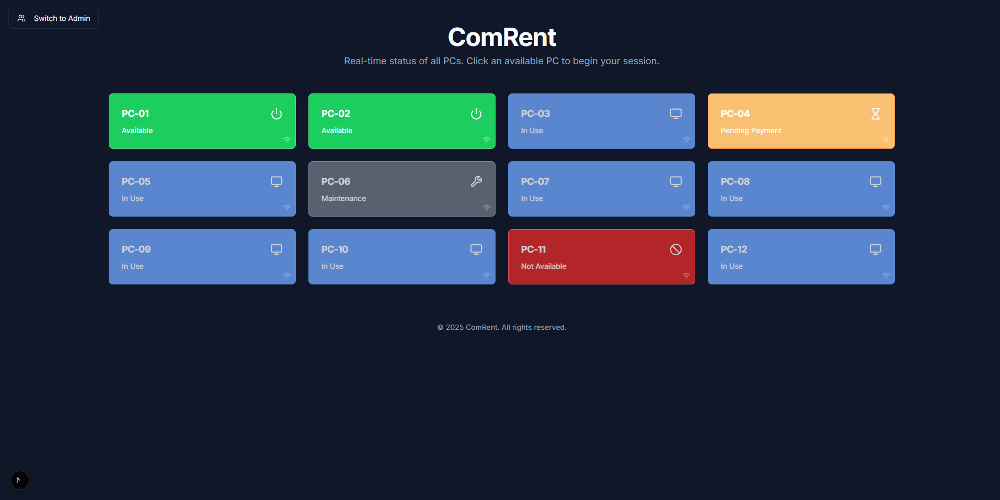
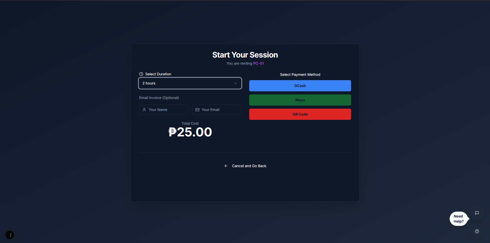
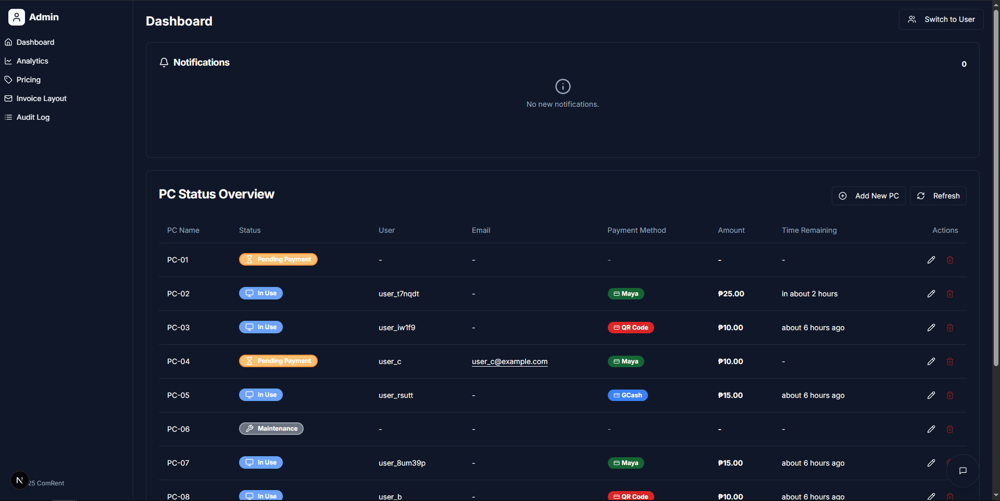
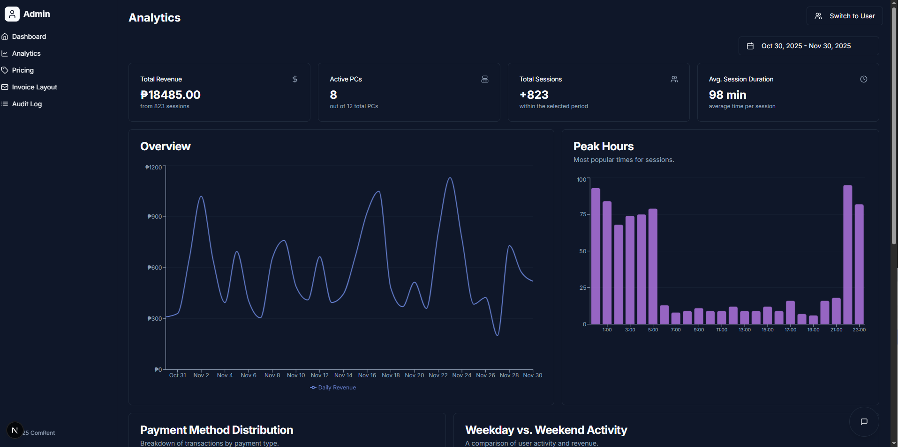
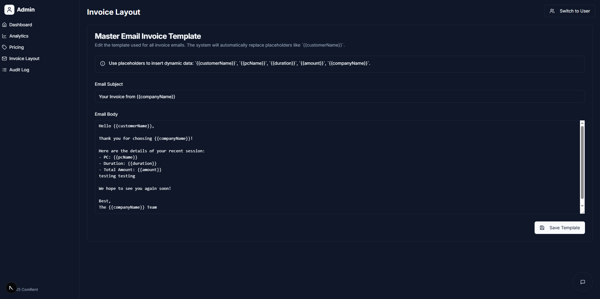

# ComRent - Real-Time PC Rental Dashboard

ComRent is a full-stack application designed to streamline the management of a computer rental center. It provides a real-time dashboard for monitoring PC statuses, a user-facing payment and session management interface, and a comprehensive admin panel for analytics, configuration, and control.







## Description

This project simulates a real-world scenario for a PC rental business, allowing users to select available computers, make payments, and manage their sessions. Admins have a powerful backend interface to oversee operations, track revenue, manage pricing, and assist users. The application is built with a modern tech stack, prioritizing a responsive user experience and robust administrative control.

## Project Journey: From Idea to Deployment

This section details the collaborative process of building the ComRent application.

### 1. Conceptualization
The project began with a simple but powerful idea: create a real-time management dashboard for a computer rental shop. We established a core set of features to build an MVP (Minimum Viable Product):
- A "User View" with a grid of PCs showing their live status (Available, In Use, etc.).
- A "Admin View" with a detailed table to monitor and manage all PCs.
- A complete user flow: select a PC, choose a rental duration, simulate payment, and start a timed session.
- An admin panel for approving sessions, managing PC statuses, and overseeing operations.

### 2. Core Development & Iteration
With the plan in place, we built the application from the ground up using a modern tech stack. The initial development focused on creating the backend APIs to manage PC statuses, pricing, and user sessions, and building the frontend components with React, Next.js, and ShadCN UI for a clean, professional look. We established the two primary interfaces: the visual grid for users and the data-rich table for admins, along with a role-switcher to move between them.

### 3. Feature Integration
As the core was solidified, we integrated key services to enhance functionality:
- **Genkit & Resend:** We implemented a Genkit flow to power our email system. This flow connects to the Resend API, allowing admins to generate and send customized invoices directly from the dashboard, complete with attached payment screenshots. This provided a seamless, professional communication channel with customers.
- **QR Code Payments:** To enhance the realism of the payment process, we integrated QR code images for GCash, Maya, and PayPal, making the user-facing payment screen more intuitive and visually engaging.

### 4. Deployment to Hostinger
With the application ready for the world, we chose **Hostinger** as our deployment platform. The process involved:
1.  Pushing the finalized code to a GitHub repository.
2.  Connecting the repository to a new project on Hostinger.
3.  Configuring the environment, including setting up the necessary environment variables (`RESEND_API_KEY`, `GEMINI_API_KEY`) and build commands.
4.  Adjusting the `package.json` `start` script to `next start -p $PORT`, a crucial step that allows the hosting provider to dynamically assign the correct port.
5.  Triggering a deployment, which Hostinger then automatically built and launched, making the application live and accessible on the web.

Through this journey, we not only built a functional application but also navigated and solved complex, real-world development and deployment challenges.

## Features

-   **Real-Time PC Status Grid**: Color-coded cards display the live status of each PC (Available, In Use, Pending Payment, Maintenance, etc.).
-   **User Session Flow**: Users can click an available PC to start the rental process, select session duration, and simulate a payment using QR codes.
-   **Live Session Timer**: Users can see their remaining time with a live countdown timer and receive alerts as their session nears its end.
-   **Admin Dashboard**: A centralized view for admins to monitor all PCs, manually change statuses, and manage user sessions.
-   **Role-Based Views**: Easily switch between the "User" view and the "Admin" view to experience both sides of the application.
-   **Analytics & Reporting**: The admin panel includes a detailed analytics dashboard to track revenue, sessions, peak usage hours, payment methods, and PC popularity.
-   **Dynamic Pricing Management**: Admins can add, edit, or delete pricing tiers for different session durations.
-   **Email Invoice Template Editor**: Admins can edit a master template for email invoices that are sent to customers.
-   **Integrated Chat**: A built-in chat system allows users to request help and admins to respond from the dashboard.
-   **Notification System**: Admins receive real-time notifications with sound alerts for important events like new payment approvals or finished sessions.

## Changelog (Recent Additions)

- **v1.5 (Analytics Overhaul)**
  - Added comprehensive analytics dashboard with multiple charts.
  - Implemented daily and monthly performance tracking (Revenue & Sessions).
  - Added charts for Peak Hours, Payment Method Distribution, and Live PC Status.
  - Included a "Session Duration per PC" line graph to visualize popularity trends.
  - Added key stat cards: Total Revenue, Total Sessions, Avg. Revenue/Session, Avg. Session Duration, and Active PCs.

- **v1.4 (Payment & UI Enhancements)**
  - Integrated real QR code images for GCash, Maya, and PayPal payment methods.
  - Added a "How-to" guide popover on the payment page to assist users.
  - Fixed a bug where a PC's status didn't update to "Pending Payment" upon selection.

- **v1.3 (Core Admin & User Features)**
  - Implemented a master email invoice template editor for admins.
  - Developed a real-time chat system for user-admin communication.
  - Created a notification panel with sound alerts for admins.
  - Added a complete audit log to track all admin actions.
  - Implemented dynamic pricing management in the admin panel.

- **v1.0 (Initial Release)**
  - Core application structure with Next.js and ShadCN.
  - Real-time PC status grid for users.
  - Basic admin dashboard with a table view.
  - User session flow from PC selection to simulated payment.

## Technologies Used

-   **Framework**: Next.js (App Router)
-   **Language**: TypeScript
-   **Styling**: Tailwind CSS
-   **UI Components**: ShadCN UI, Lucide Icons
-   **Charting**: Recharts
-   **State Management**: React Hooks (useState, useEffect, useContext)
-   **AI Integration**: Genkit (for email generation flows)
-   **Email Sending**: Resend
-   **Deployment**: Hostinger

## Getting Started

To get a local copy up and running, follow these simple steps.

### Prerequisites

-   Node.js (v18 or newer recommended)
-   npm, yarn, or pnpm

### Installation

1.  **Clone the repository:**
    ```bash
    git clone <your-repository-url>
    cd comrent
    ```

2.  **Install dependencies:**
    ```bash
    npm install
    ```

3.  **Set up environment variables:**
    Create a `.env` file in the root of the project and add the necessary API keys.

    ```.env
    RESEND_API_KEY=your_resend_api_key
    GEMINI_API_KEY=your_google_ai_api_key
    ```

4.  **Run the development server:**
    ```bash
    npm run dev
    ```
    Open [http://localhost:9002](http://localhost:9002) to view it in your browser.

## Deployment

This application is configured for deployment on platforms like [Hostinger](https://www.hostinger.com/), [Railway](https://railway.app/), or [Vercel](https://vercel.com/).

The `package.json` `start` script is set to `next start -p $PORT`, which allows the hosting provider to dynamically assign the port for the application to run on. Simply connect your GitHub repository to your hosting provider of choice, and it should build and deploy automatically.

## Future Enhancements

-   **Full User Authentication**: Implement a complete user account system where users can register, log in, view their session history, and save payment methods.
-   **PC Reservation System**: Allow users to book or reserve a specific PC for a future time slot.
-   **Real Payment Gateway**: Replace the simulated QR code flow with a real payment gateway integration like Stripe for automated payment confirmation.
-   **Advanced PC Management**: Add features for admins to remotely lock, restart, or shut down PCs directly from the dashboard.
-   **Data Persistence**: Replace the in-memory data stores with a proper database (e.g., Firebase Firestore, Supabase, or a traditional SQL database) to persist all data.

## Acknowledgements

-   This project was bootstrapped and developed with the assistance of Firebase Studio.
-   UI components are from the excellent [ShadCN UI](https://ui.shadcn.com/) library.
-   Charting capabilities provided by [Recharts](https://recharts.org/).
-   Email delivery is powered by [Resend](https://resend.com/).
-   Icons provided by [Lucide](https://lucide.dev/).

## License

This project is open-source and available under the MIT License.
